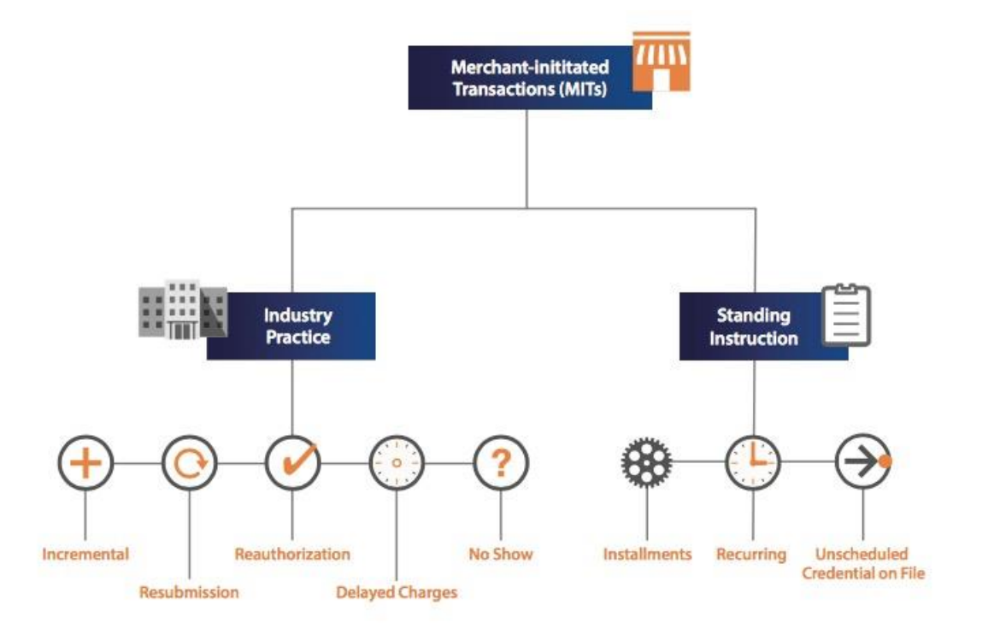

# Payment Note

- [Payment Note](#payment-note)
- [Merchant Initiated Transactions](#merchant-initiated-transactions)
  - [Background](#background)
  - [Cardholder Initiated Transactions](#cardholder-initiated-transactions)
  - [Merchant Initiated Transaction](#merchant-initiated-transaction)
  - [MIT Use Cases](#mit-use-cases)
  - [Different types of MIT categories](#different-types-of-mit-categories)
    - [Incremental](#incremental)
    - [Resubmission](#resubmission)
    - [Reauthorization](#reauthorization)
    - [Delayed Charges](#delayed-charges)
    - [No Show](#no-show)
    - [Installment Payments](#installment-payments)
    - [Recurring Payments](#recurring-payments)
    - [Unscheduled Credential on File (UCOF)](#unscheduled-credential-on-file-ucof)
- [Strong Customer Authentication](#strong-customer-authentication)
- [Reference](#reference)

---

# Merchant Initiated Transactions

`
Most authorizations are initiated by a cardholder in person, on the phone, or on a web site. A merchant-initiated transaction (MIT) is an authorization that you initiate when the cardholder is not present.
`

---

## Background

Visa implemented two new **Transaction Frameworks** with data values in the authorization messages:

- `Stored Credential Transaction Framework`: enables merchants/acquirers to identify initial storage and use of stored payment credentials.

- `Merchant Initiated Transaction Framework`: divides transactions into two categories – *Cardholder Initiated Transactions (CIT)* and *Merchant Initiated Transactions (MIT)* – and enables merchants/acquirers to identify
the types of MITs. MIT framework also provides the ability to link the MIT to a cardholder-merchant’s initial interaction.

These frameworks provide greater visibility into transactions, allowing every stakeholder in the payment value chain to better **manage risk and fraud**, thereby
offering the opportunity for **better approval rates**, **fewer customer complaints** and an **improved cardholder experience**.

---

## Cardholder Initiated Transactions

A CIT can be any of the following kinds of transactions:

- `Card present`: cardholder goes to a brick-and-mortar store in person to make a purchase and provides payment information in the store.

- `Credential-on-File, COF`: cardholder orders an item online and instructs you to use the payment information that is *saved in your system*.

- `E-commerce`: cardholder orders an item online and provides payment information during checkout.

- `MOTO`: cardholder orders an item over the telephone and provides payment information to the person who is taking the order.

 

## Merchant Initiated Transaction

To comply with the Merchant Initiated Transaction framework, the merchant/acquirer must:

- Identify the intent of the MIT by providing appropriate identifiers in the transaction using **fields Message Reason Code** or **POS Environment Code**.

- Provide proof of a preceding transaction by creating a linkage with it by using the Transaction Identifier2 of the previous or original transaction

---

## MIT Use Cases

The MIT framework covers two types of MITs:

- Industry-Specific Business Practice MITs
- Standing Instruction MITs

 

## Different types of MIT categories

|          MIT Category          |        Intent        |
| :----------------------------: | :------------------: |
|          Incremental           | Message Reason Code  |
|          Resubmission          | Message Reason Code  |
|        Reauthorization         | Message Reason Code  |
|        Delayed Charges         | Message Reason Code  |
|            No Show             | Message Reason Code  |
|          Installments          | POS Environment Code |
|           Recurring            | POS Environment Code |
| Unscheduled Credential on File | POS Environment Code |

 

### Incremental

A continuation of a purchase when the originally approved amount is modified to accommodate additional services. Incremental authorizations are typical for `lodging transactions` and `auto rental transactions`.

- Incremental authorizations can be used to increase the total amount authorized if
the authorized amount is insufficient. 

- Incremental authorizations do not replace the original authorization—they are additional to previously authorized amounts. 

- One or more incremental authorizations can be requested while the transaction has not yet been finalized (submitted for clearing). 

- Incremental authorizations must not be used once the original transaction has been submitted for clearing. In such a scenario, a new authorization must be requested, with the appropriate reason code (e.g., delayed charges, reauthorization).

 

### Resubmission

Occurs when a cardholder-initiated purchase occurred, but you `could not obtain an authorization at that time`. 

- A resubmission is valid only when the original authorization was declined for insufficient funds and only for a limited number of days after the original purchase.

- When the goods or services were already delivered to the cardholder, Merchants in such scenarios can resubmit the request to recover outstanding debt from cardholders.

 

### Reauthorization

a `split shipment` occurs when goods are not available for shipment when the cardholder purchases them. When the goods become available to ship, a new authorization is performed to `make sure that the cardholder's funds are still available`.

- A merchant initiates a reauthorization when the completion or fulfillment of
the original order or service extends beyond the authorization validity limit set by Visa. 

There are two common reauthorization scenarios:

1. Split or delayed shipments at eCommerce retailers. If the fulfillment
of the goods takes place after the authorization validity limit set by Visa, eCommerce
merchants perform a separate authorization to ensure that consumer funds are available.

2. Extended stay hotels, car rentals, and cruise lines. A reauthorization is used for stays, voyages, and/or rentals that extend beyond the authorization validity period set by Visa.

 

### Delayed Charges

Performed to process a supplemental account `charge after original services have been rendered` and respective payment has been processed.

- Typical for lodging transactions and auto rental transactions.

 

### No Show

Occurs when you and a cardholder have an agreement for a purchase, but the cardholder does not meet the terms of the agreement. No-show transactions are typically used in hotels and motels for a single-night stay.

- Cardholders can use their Visa cards to make a guaranteed reservation with certain
merchant segments. 

- A guaranteed reservation ensures that the reservation will be honored and allows a merchant to perform a No Show transaction to charge the cardholder a penalty according to the merchant’s cancellation policy.

-  For merchants that accept token-based payment credentials to guarantee a reservation, it is necessary to perform a CIT (Account Verification Service) at the time of reservation to be able perform a No Show transaction later.

 

### Installment Payments

An installment payment is a COF transaction. A series of installment payments consists of multiple transactions that you bill to a cardholder over a period of time agreed to by you and the cardholder for a single purchase of goods or services. The agreement enables you to charge a specific amount at specified intervals.

 

### Recurring Payments

A series of recurring payments consists of multiple transactions that you bill to a cardholder at `fixed`, `regular intervals not to exceed one year between transactions`, representing cardholder agreement for the merchant to initiate future transactions for the purchase of goods or services provided at regular intervals.

 

### Unscheduled Credential on File (UCOF)

An unscheduled COF transaction uses stored payment information for a fixed or variable amount that does not occur on a scheduled or regular basis.

- An example of such transaction is an account auto-top up transaction.

- Auto top-up means when your account drops below £3 it'll automatically top up by the amount you've selected (via credit / debit card), up to a maximum per month that you've specified.

***

# Strong Customer Authentication

***

# Reference

- [VISA - Clarifications on Stored Credentials and MIT Framework Mandates](https://usa.visa.com/dam/VCOM/global/support-legal/documents/visa-clarifications-on-stored-credentials.pdf)

- [cybersource - Apple Pay Integrations : Merchant-Initiated Transactions](http://apps.cybersource.com/library/documentation/dev_guides/apple_payments/SO_API/html/wwhelp/wwhimpl/js/html/wwhelp.htm#href=ch_intro.4.3.html)

- [Stripe - Strong Customer Authentication](https://stripe.com/guides/strong-customer-authentication)