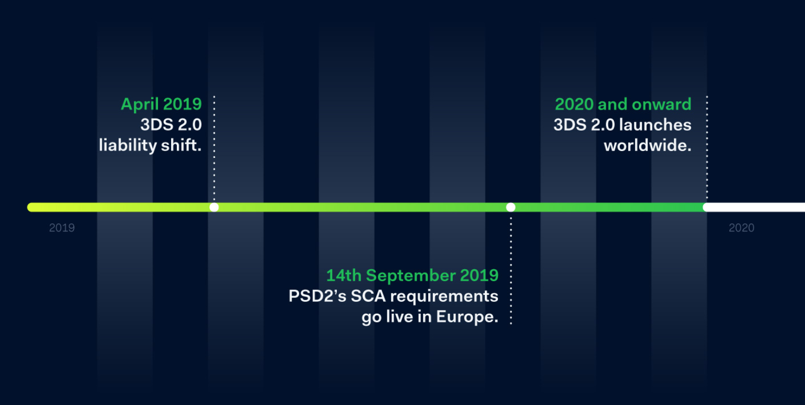
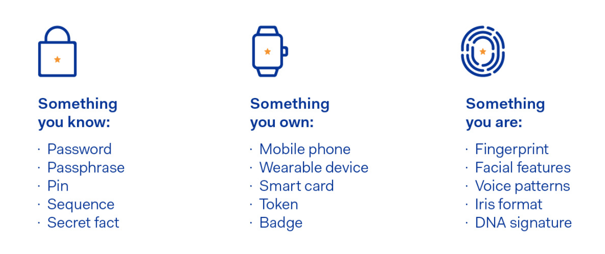

# Payment Note

- [Payment Note](#payment-note)
- [Payments Service Directive 2 - PSD2](#payments-service-directive-2---psd2)
  - [PSD2 Timeline](#psd2-timeline)
  - [PSD2 in a nutshell](#psd2-in-a-nutshell)
    - [What relevant information is to be provided to the competent authorities](#what-relevant-information-is-to-be-provided-to-the-competent-authorities)
  - [What will PSD2 and SCA mean for Merchants](#what-will-psd2-and-sca-mean-for-merchants)
  - [Getting ready for PSD2 and SCA - Amazon Pay](#getting-ready-for-psd2-and-sca---amazon-pay)
- [Strong Customer Authentication](#strong-customer-authentication)
  - [Two-factor authentication as standard](#two-factor-authentication-as-standard)
  - [When is Strong Customer Authentication required](#when-is-strong-customer-authentication-required)
  - [How to authenticate a payment](#how-to-authenticate-a-payment)
  - [Exemptions to Strong Customer Authentication](#exemptions-to-strong-customer-authentication)
    - [SCA Exemptions Overall](#sca-exemptions-overall)
    - [Out of scope Trabsactions regardless of their value](#out-of-scope-trabsactions-regardless-of-their-value)
    - [Low-risk transactions](#low-risk-transactions)
    - [Payments below €30](#payments-below-%E2%82%AC30)
    - [Fixed-amount subscriptions](#fixed-amount-subscriptions)
    - [Merchant-initiated transactions (including variable subscriptions)](#merchant-initiated-transactions-including-variable-subscriptions)
      - [Why MITs is out of scope of the SCA](#why-mits-is-out-of-scope-of-the-sca)
      - [Exception of MITs](#exception-of-mits)
    - [Trusted beneficiaries](#trusted-beneficiaries)
    - [Phone sales](#phone-sales)
    - [Corporate payments](#corporate-payments)
  - [Grandfathering Rule](#grandfathering-rule)
  - [Tools that can increase exemption levels](#tools-that-can-increase-exemption-levels)
  - [What happens if an exemption fails](#what-happens-if-an-exemption-fails)
- [Merchant Initiated Transactions](#merchant-initiated-transactions)
  - [Background](#background)
  - [Cardholder Initiated Transactions](#cardholder-initiated-transactions)
  - [Merchant Initiated Transaction](#merchant-initiated-transaction)
  - [MIT Use Cases](#mit-use-cases)
  - [Different types of MIT categories](#different-types-of-mit-categories)
    - [Incremental](#incremental)
    - [Resubmission](#resubmission)
    - [Reauthorization](#reauthorization)
    - [Delayed Charges](#delayed-charges)
    - [No Show](#no-show)
    - [Installment Payments](#installment-payments)
    - [Recurring Payments](#recurring-payments)
    - [Unscheduled Credential on File (UCOF)](#unscheduled-credential-on-file-ucof)
- [Stripe Payments Webinar](#stripe-payments-webinar)
- [References](#references)

---

# Payments Service Directive 2 - PSD2

## PSD2 Timeline

1. On `October 8, 2015`, the European Parliament adopted the European Commission proposal to create safer and more innovative European payments (PSD2, Directive (EU) 2015/2366). 

2. On `November 16, 2015`, the Council of the European Union passed PSD2. Member states will *have two years* to incorporate the directive into their national laws and regulations.

3. The EU and many banks are pushing this development with the new Payments Service Directive 2 (PSD2), which has come into force on `13 January 2018`. 

4. Banks need to adapt to these changes that open many technical challenges, but also many strategic opportunities, such as **collaborating with fintech providers**, for the future.

> An important element of PSD2 is the requirement for strong **customer authentication** on the majority of electronic payments.

> Another important element of the directive is the demand for **common and secure communication** (CSC). 

5. On `January 13, 2018`, Directive 2007/64/EC is repealed and replaced by Directive (EU) 2015/2366

6. On `March 14, 2019`, All Financial Institutions offering an API solution must have it available for external testing by **PISPs** and **AISPs**

7. On `April 2019`, 3DS 2.0 liability shift. Both Visa and Mastercard are encouraging banks to get ready for PSD2 by being 3DS 2.0 compliant. 

8. On `September 14, 2019`, The final deadline for all companies within the EU to comply with PSD2’s Regulatory Technical Standard (RTS) pertaining to directive (EU) 2015/2366 (PSD2)

9. On `2020`, 3DS 2.0 launches worldwide.

---

## PSD2 in a nutshell

`PSD2` must be transposed into the national laws by 13 January 2018. However, payment institutions which have already obtained authorisation under Directive `PSD1` will be **grandfathered to continue operating under their existing authorisation until 13 July 2018**. 

In order to perform the activities, for which they have been authorised, beyond this transitional period, the existing payment institutions and e-money issuers would need to submit all relevant information required under PSD2 to the competent authorities that have granted them their existing licenses and fully comply with the relevant PSD2 requirements.

//TODO

---

### What relevant information is to be provided to the competent authorities

1. Procedure to monitor, handle and follow up on security incidents and security-related customer complaints, including an incidents reporting mechanism.

2. Process to file, monitor, track and restrict access to sensitive payment data.

3. Business continuity arrangements - including a clear identification of the critical operations, effective contingency plans and a procedure to regularly test and review the adequacy and efficiency of such plans.

4. The principles and definitions applicable to the collection of statistical data on performance, transactions and fraud.

5. Security policy document - including a detailed risk assessment in relation to its payment services and a description of security control and mitigation measures taken to adequately protect payment service users against the risks identified, including fraud and illegal use of sensitive and personal data.

---

## What will PSD2 and SCA mean for Merchants

> The big idea behind PSD2 is to encourage greater competition and innovation.

An initiative called `Access to Accounts (XS2A)` will bring Account Information and Payment Initiation services under regulation and allow **non-banks** to offer payment services.

> The EU wants to improve security and reduce fraud by introducing Strong Consumer Authentication (SCA) for electronic payments.

This feature that will come into force on September 14.

---

## Getting ready for PSD2 and SCA - Amazon Pay

//TODO

***

# Strong Customer Authentication

- Strong Customer Authentication (SCA) is a new European regulatory requirement to reduce fraud and make online payments more secure. 

- To accept payments once SCA goes into effect, you will need to build additional authentication into your checkout flow. 

---

## Two-factor authentication as standard

The most common way organisations will comply with SCA for card payments, is to adopt the payment **security process 3DS 2.0** (the latest version of 3D Secure). This provides more potential fraud signals, shares 135 data points and supports biometrics.

SCA will mean extra hoops for shoppers to jump through when making electronic payments. Customers will have to present **two out of three factors** from the following list:

- Something you are (e.g. biometrics, such as a fingerprint)

- Something you have (e.g. a pre-registered device or token generator)

- Something you know (e.g. a password or PIN)

`For the customers`: with SCA, this will become the norm , not the exception. 

`For retailers`: this could sound like awful news (most global merchants will be affected if they have EU issued cards transacting via an EU acquirer). No retailer likes the idea of customers losing their nerve or running out of patience at the checkout because there’s another obstacle in their way.

---

## When is Strong Customer Authentication required

- Strong Customer Authentication will apply to “customer-initiated” online payments within Europe. 

- As a result, most card payments and all bank transfers will require SCA. 
  
- Recurring direct debits on the other hand are considered “merchant-initiated” and will not require strong authentication.

-  With the exception of contactless payments, in-person card payments are also not impacted by the new regulation.

---

## How to authenticate a payment

- `3D Secure`: Applying 3D Secure typically adds an extra step after the checkout where the cardholder is prompted by their bank to provide additional information to complete a payment (e.g., a one-time code sent to their phone or fingerprint authentication through their mobile banking app).

- `3D Secure 2`: the new version of the authentication protocol rolling out in 2019. It will be the main method for authenticating online card payments and meeting the new SCA requirements.

---

## Exemptions to Strong Customer Authentication

Under this new regulation (PSD2), specific types of low-risk payments may be exempted from Strong Customer Authentication.

Payment providers like Stripe will be able to request these exemptions when processing the payment. 

The cardholder’s bank will then receive the request, assess the risk level of the transaction, and ultimately **decide whether to approve the exemption** or **whether authentication is still necessary**.

Using exemptions for low-risk payments can reduce the number of times you will need to authenticate a customer and reduce friction.

 

### SCA Exemptions Overall

- `Low value transactions` — Those of €30 or less are not included within SCA. 

- Regular payments of the same amount can be included, but must not accumulate to over €100 or SCA will be triggered

- `Trusted listings` — Consumers can ask the issuer for a merchant to be part of a ‘**trusted payee**’ list

- `Low risk transactions` — The highest value agreed would be €500 and the merchant must maintain a low average fraud rate to keep this

 

### Out of scope Trabsactions regardless of their value

- `Merchant Initiated Transactions` (MIT) – Repeat payments

- Mail Order / Telephone Order (MOTO) – Telephone / contact centre payments

- One Leg Out (OLO) – Where the issuer or the acquirer is outside the EEA

---

### Low-risk transactions

- A payment provider (like Stripe) will be allowed to do a **real-time risk analysis** to determine whether to apply SCA to a transaction. 

- This may only be possible if the payment provider’s or bank’s overall fraud rates for card payments do not exceed the following thresholds:

- - 0.13% to exempt transactions below €100
- - 0.06% to exempt transactions below €250
- - 0.01% to exempt transactions below €500

- In cases, where only the payment provider’s fraud rate is below the threshold, but the cardholder’s bank is above it, we expect the bank to decline the exemption and require authentication.

 

### Payments below €30

- Transactions below €30 will be considered “low value” and may be exempted from SCA. 

- Banks will however need to request authentication if the exemption has been used five times since the cardholder’s last successful authentication or if the sum of previously exempted payments exceeds €100.

 

### Fixed-amount subscriptions

- This exemption can apply when the customer makes a series of recurring payments for the same amount, to the same business.

- SCA will be required for the customer’s first payment—subsequent charges however may be exempted from SCA.

[Example to create subscriptions - Stripe Billing](https://stripe.com/billing#sca)

 

### Merchant-initiated transactions (including variable subscriptions)

To use merchant-initiated transactions, you will need to authenticate the card either when it’s being saved or on the first payment. Finally, you will need to get an agreement from the customer (also referred to as a “mandate”), in order to charge their card at a later point.

`More Details in the below section` : [Merchant Initiated Transactions](#merchant-initiated-transactions)

#### Why MITs is out of scope of the SCA

- Because the transactions are initiated by the payee only without any direct intervention from the payer. 

- This is in the same way as Direct Debits, which are also initiated by payees without any direct intervention from the payer, based on an initial mandate. 
  
- The initial authority (or mandate) may itself be caught by the SCA requirement if given electronically under the third ‘other action’ requirements of the RTS, but is not in scope if given on paper or over the telephone. 
  
- It doesn’t matter how the authority is first given (paper, by telephone or electronically), so long as it is given validly and proper records are kept, to enable a ‘look-back’ when a transaction is disputed. 
  
- It also doesn’t matter if the MITs occur with varying frequency or for varying amounts, so long as they are consistent with the authority given.

#### Exception of MITs

- MITs must be distinguished from ‘**card on file**’ transactions where the payer confirms payment and use of payment card details previously supplied. 
  
- Along the lines: `Confirm payment using your default card, card number XXXX XXXX XXXX 1234`. These card payments are not MITs as they are clearly initiated by the payer and so SCA must be applied unless an exemption is available.

 

### Trusted beneficiaries

- When completing authentication for a payment, customers may have the option to whitelist a business they trust to avoid having to authenticate future purchases. 

- These businesses will be included on a list of “trusted beneficiaries” maintained by the customer’s bank or payment service provider.

### Phone sales

- Card details collected over the phone fall outside the scope of SCA and do not require authentication. 

- This type of payment is sometimes referred to as “Mail Order and Telephone Orders” (MOTO). 

- Marking a payment as being a MOTO transaction will be similar to requesting other exemptions, with the cardholder’s bank making the final decision to accept or reject the transaction.

### Corporate payments

- This exemption may cover payments that are made with “lodged” cards, as well as corporate payments made using virtual card numbers.

 

## Grandfathering Rule

- Place to remove the need to re-authenticate existing card-on-file customers.

- However, **any change to that customer’s registration** with the merchant would trigger the need for re-authentication.

 

## Tools that can increase exemption levels

- Visa Transaction Advisor: This is a Cybersource tool used to identify the opportunity for an exemption

- Visa Trusted Listing: This allows customers to request that a merchant is added to the trusted listing as part of the 3DS transaction — to remember things for next time

However, sometimes a green light might still get a red light. That’s because, despite all the possible exemptions, **issuers may still decline them and force the extra authentication anyway**.

---

## What happens if an exemption fails

Banks will return new decline codes for payments that failed due to missing authentication. These payments will then have to be resubmitted to the customer with a request for Strong Customer Authentication.

***

# Merchant Initiated Transactions

`
Most authorizations are initiated by a cardholder in person, on the phone, or on a web site. A merchant-initiated transaction (MIT) is an authorization that you initiate when the cardholder is not present.
`

---

## Background

Visa implemented two new **Transaction Frameworks** with data values in the authorization messages:

- `Stored Credential Transaction Framework`: enables merchants/acquirers to identify initial storage and use of stored payment credentials.

- `Merchant Initiated Transaction Framework`: divides transactions into two categories – *Cardholder Initiated Transactions (CIT)* and *Merchant Initiated Transactions (MIT)* – and enables merchants/acquirers to identify
the types of MITs. MIT framework also provides the ability to link the MIT to a cardholder-merchant’s initial interaction.

These frameworks provide greater visibility into transactions, allowing every stakeholder in the payment value chain to better **manage risk and fraud**, thereby
offering the opportunity for **better approval rates**, **fewer customer complaints** and an **improved cardholder experience**.

---

## Cardholder Initiated Transactions

A CIT can be any of the following kinds of transactions:

- `Card present`: cardholder goes to a brick-and-mortar store in person to make a purchase and provides payment information in the store.

- `Credential-on-File, COF`: cardholder orders an item online and instructs you to use the payment information that is *saved in your system*.

- `E-commerce`: cardholder orders an item online and provides payment information during checkout.

- `MOTO`: cardholder orders an item over the telephone and provides payment information to the person who is taking the order.

 

## Merchant Initiated Transaction

To comply with the Merchant Initiated Transaction framework, the merchant/acquirer must:

- Identify the intent of the MIT by providing appropriate identifiers in the transaction using **fields Message Reason Code** or **POS Environment Code**.

- Provide proof of a preceding transaction by creating a linkage with it by using the Transaction Identifier2 of the previous or original transaction

---

## MIT Use Cases

The MIT framework covers two types of MITs:

- Industry-Specific Business Practice MITs
- Standing Instruction MITs

 

## Different types of MIT categories

|          MIT Category          |        Intent        |
| :----------------------------: | :------------------: |
|          Incremental           | Message Reason Code  |
|          Resubmission          | Message Reason Code  |
|        Reauthorization         | Message Reason Code  |
|        Delayed Charges         | Message Reason Code  |
|            No Show             | Message Reason Code  |
|          Installments          | POS Environment Code |
|           Recurring            | POS Environment Code |
| Unscheduled Credential on File | POS Environment Code |

 

### Incremental

A continuation of a purchase when the originally approved amount is modified to accommodate additional services. Incremental authorizations are typical for `lodging transactions` and `auto rental transactions`.

- Incremental authorizations can be used to increase the total amount authorized if
the authorized amount is insufficient. 

- Incremental authorizations do not replace the original authorization—they are additional to previously authorized amounts. 

- One or more incremental authorizations can be requested while the transaction has not yet been finalized (submitted for clearing). 

- Incremental authorizations must not be used once the original transaction has been submitted for clearing. In such a scenario, a new authorization must be requested, with the appropriate reason code (e.g., delayed charges, reauthorization).

 

### Resubmission

Occurs when a cardholder-initiated purchase occurred, but you `could not obtain an authorization at that time`. 

- A resubmission is valid only when the original authorization was declined for insufficient funds and only for a limited number of days after the original purchase.

- When the goods or services were already delivered to the cardholder, Merchants in such scenarios can resubmit the request to recover outstanding debt from cardholders.

 

### Reauthorization

a `split shipment` occurs when goods are not available for shipment when the cardholder purchases them. When the goods become available to ship, a new authorization is performed to `make sure that the cardholder's funds are still available`.

- A merchant initiates a reauthorization when the completion or fulfillment of
the original order or service extends beyond the authorization validity limit set by Visa. 

There are two common reauthorization scenarios:

1. Split or delayed shipments at eCommerce retailers. If the fulfillment
of the goods takes place after the authorization validity limit set by Visa, eCommerce
merchants perform a separate authorization to ensure that consumer funds are available.

2. Extended stay hotels, car rentals, and cruise lines. A reauthorization is used for stays, voyages, and/or rentals that extend beyond the authorization validity period set by Visa.

 

### Delayed Charges

Performed to process a supplemental account `charge after original services have been rendered` and respective payment has been processed.

- Typical for lodging transactions and auto rental transactions.

 

### No Show

Occurs when you and a cardholder have an agreement for a purchase, but the cardholder does not meet the terms of the agreement. No-show transactions are typically used in hotels and motels for a single-night stay.

- Cardholders can use their Visa cards to make a guaranteed reservation with certain
merchant segments. 

- A guaranteed reservation ensures that the reservation will be honored and allows a merchant to perform a No Show transaction to charge the cardholder a penalty according to the merchant’s cancellation policy.

-  For merchants that accept token-based payment credentials to guarantee a reservation, it is necessary to perform a CIT (Account Verification Service) at the time of reservation to be able perform a No Show transaction later.

 

### Installment Payments

An installment payment is a COF transaction. A series of installment payments consists of multiple transactions that you bill to a cardholder over a period of time agreed to by you and the cardholder for a single purchase of goods or services. The agreement enables you to charge a specific amount at specified intervals.

 

### Recurring Payments

A series of recurring payments consists of multiple transactions that you bill to a cardholder at `fixed`, `regular intervals not to exceed one year between transactions`, representing cardholder agreement for the merchant to initiate future transactions for the purchase of goods or services provided at regular intervals.

 

### Unscheduled Credential on File (UCOF)

An unscheduled COF transaction uses stored payment information for a fixed or variable amount that does not occur on a scheduled or regular basis.

- An example of such transaction is an account auto-top up transaction.

- Auto top-up means when your account drops below £3 it'll automatically top up by the amount you've selected (via credit / debit card), up to a maximum per month that you've specified.

***

# Stripe Payments Webinar

[Strong Customer Authentication: Planning for the new European Payments Regulation](https://stripe.zoom.us/recording/play/kMO60n1jdrUS738XJ8TOuJxXqS4YiJ9YtgF689Lq32QwGMVywwfvrO_VQYYt8L8u?autoplay=true)

***

# References

- [VISA - Clarifications on Stored Credentials and MIT Framework Mandates](https://usa.visa.com/dam/VCOM/global/support-legal/documents/visa-clarifications-on-stored-credentials.pdf)

- [cybersource - Apple Pay Integrations : Merchant-Initiated Transactions](http://apps.cybersource.com/library/documentation/dev_guides/apple_payments/SO_API/html/wwhelp/wwhimpl/js/html/wwhelp.htm#href=ch_intro.4.3.html)

- [Contact-Center - PSD2 & SCA: What Do We Need To Know, Right Now?](https://contact-centres.com/psd2-sca-what-do-we-need-to-know-right-now/)

- [amazon pay - Getting ready for PSD2 and Strong Customer Authentication (SCA)](https://pay.amazon.co.uk/help/JE5KSJW4SFH2UM8)

- [Osborneclarke fintech - MITs might be out of scope of SCA?](https://www.osborneclarke-fintech.com/2019/02/01/mits-might-be-out-of-scope-of-sca/)

- [pwc - PSD2 in a nutshell: Market environment and implementation timeline](https://www.pwc.com/cz/en/bankovnictvi/assets/psd2-nutshell-n01-en.pdf)

- [SlimPay - PSD2 & Instant Payment Basics – Strong Customer Authentication (SCA)](https://www.slimpay.com/blog/psd2-instant-payment-basics-strong-customer-authentication/)

- [Stripe - Strong Customer Authentication](https://stripe.com/guides/strong-customer-authentication)

- [LinkedIn Post - Published by Tudor Nistor](https://www.linkedin.com/pulse/psd2-6-months-grandfathering-after-possible-loose-your-tudor-nistor/)